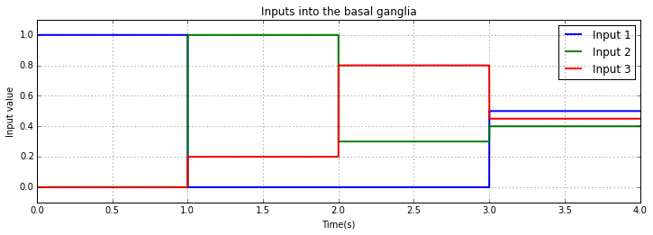
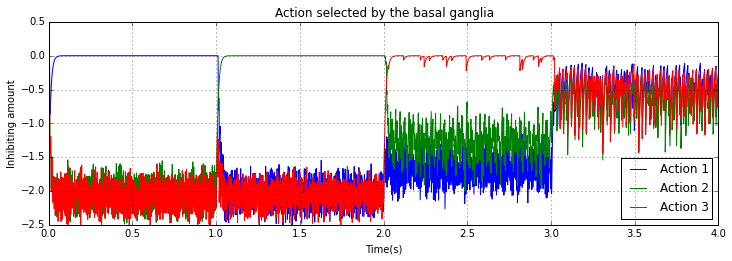

.. _action_selection_demo:

Action selection
================

The basal ganglia's action selection relies on inhibitory connections
into the thalamus, thus the selected action is the one which isn't
inhibited. As a result, our system could receive 5 input signals, 3 for
selecting the required action and 2 for representing any additional
information required to execute the action (for example, selecting the
action "silence" we would require an (x,y) position so as to face the
approaching target and respectfully telling them to be quiet).

.. note::

    By default, the range of representable values using ensembles
    of neurons is [-1, 1].

.. sourcecode:: python
    :linenos:

    import nengo
    import numpy as np
    from numpy import sign as sgn
    from nengo.utils.functions import piecewise
    import matplotlib.pyplot as plt
    %matplotlib inline

    """
    Action selection achieved by using a basal ganglia implementation

    |Currently considered robot actions:
    \
     |-Talking to another robot
     |-Silencing the crowd
     |-Talk to approaching human
    """

    model = nengo.Network("Action selector", seed=len("SpiNNaker"))
    generator = piecewise({0:[1,0,0,0,0],1:[0,1,0.2,0,0], 2:[0,0.3,0.8,0,0], 3:[0.5,0.4,0.45,0,0]})
    with model:
        d = 5
        basal_ganglia = nengo.networks.BasalGanglia(dimensions=3)
        control_signal = nengo.Node(output =generator, label="actions")
        nengo.Connection(control_signal[0:3], basal_ganglia.input, synapse=None)
        action_probe = nengo.Probe(basal_ganglia.output, synapse=0.01)

    sim = nengo.Simulator(model)
    sim.run(4.0)

The first graph shows the input values into the basal ganglia, the
higher the "goodness" of the input translates into selecting that action
(uninhibiting that action). This selection is obvious in the second
graph when the selected action is uninhibited (the value fed into the
neurons in the ensemble is 0), as opposed to the inhibited actions which
feed a very large negative value into each neuron in the postsynaptic
population.

From time 0 until time 1 the selected action definitely the "best", same
for time 1 until time 2, but at this point we decide (in our simulation)
that Input 2 is might be "good" as well. As a result, the ganglia is not
completely sure about the selected action, but that is fine because the
other two are still quite heavily inhibited.

From time 3 until time 4 there is no definitive best action. This
translates into all actions being slightly selected, which might not
yield the desired output. For example, this could have the effect of
making the robot try to silence the crowd, have a conversation with the
other robot and try to tell an approaching human to be quiet at the same
time - might not be possible if the sets of motors needed for each task
overlap.

This last situation is an example of how neural driven control systems
differ from from classical control theory. Viewed as a production
system, clearly the basal ganglia can easily do multiple actions at
once, in parallel, while a classical production system would have to
check through each condition iteratively to choose an action to be executed.

