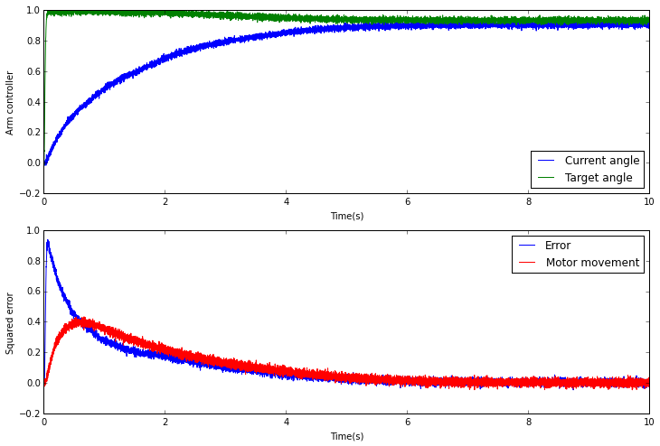
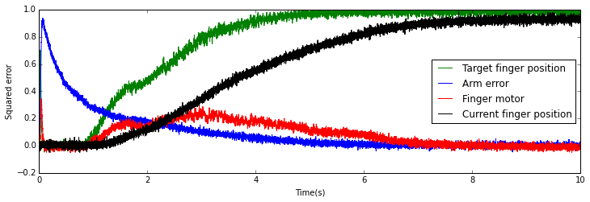

Forearm and finger movement
===========================

The forearm starts at a given position represented in degrees. The
direction and amount of movement needed to reach the given target is
given by the error function used (in this case, squared difference). The
same value used from the error population to update the current position
is sent to the motor.

When implemented for a specific robot, the error will involve receiving
feedback from the sensors regarding the motor's actual position.

.. sourcecode:: python

    import nengo
    import numpy as np
    import matplotlib.pyplot as plt
    %matplotlib inline
    from nengo.utils.functions import piecewise

    """
    Script that simulates a 1 DOF arm rotating in order to reach an object in
    a random location

    The point around which the "arm" rotates is the origin of the system (0,0)
    """

    model = nengo.Network("2DOF (Forearm + Finger)", seed=len("SpiNNaker"))

    # test_data = {0: 0.5, 8: -0.2, 16: 1.0, 24: -1.0, 32: 0.0}

    def error(x):
        """
        Squared-error function. Also gives the required direction of movement
        :param x: A vector consisting of the target orientation [1] and the current
        number of degrees [0]
        :type x: float[2]
        :return: The correction needed to match the target
        :rtype: float
        """
        return np.sign(x[1] - x[0]) * ((x[0] - x[1]) ** 2)

    def inhibit(x):
        return np.abs(x[0] * 2.0)

    # Part concerned with reaching the target
    with model:
        # Time constant for synapses (found experimentally)
        tau = 0.95
        # Population radii           (found experimentally)
        radius = 1.2
        # Node to input the initial orientation of the arm
        # Arm needs to be initialized to its initial position (reference position)
        initial_angle = nengo.Node(output=0.0)
        # The ensemble representing the current orientation
        current = nengo.Ensemble(n_neurons=200, dimensions=1, radius=radius)
        nengo.Connection(pre=initial_angle, post=current, transform=[[tau]],
                         synapse=tau)
        # Node to input the target angle (orientation)
        object_angle = nengo.Node(output=1.0)
        # The ensemble representing the target's orientation
        target = nengo.Ensemble(n_neurons=200, dimensions=1, radius=radius)
        nengo.Connection(pre=object_angle, post=target)
        # The ensemble that combines the two signals (target and current
        # orientation)
        controller = nengo.Ensemble(n_neurons=600, dimensions=2, radius=radius)

        # Connections between the current --> controller and target --> controller
        nengo.Connection(pre=current, post=controller[0])
        nengo.Connection(pre=target, post=controller[1])

        # Ensemble that approximates the error function
        _error = nengo.Ensemble(n_neurons=300, dimensions=1, radius=radius,
                                label="Error")

        nengo.Connection(pre=controller, post=_error, function=error)

        # Connections that feedback into current
        nengo.Connection(pre=_error, post=current, transform=[[tau]], synapse=tau)
        nengo.Connection(pre=current, post=current, transform=[[1]], synapse=tau)

        # Simulated motor neurons
        motor = nengo.Ensemble(n_neurons=100, dimensions=1, radius=1)
        nengo.Connection(pre=_error, post=motor, synapse=tau / 2.0)

    # Action to be completed once target is reached
    # (in this case finger being lifted)
    with model:
        # The ensemble representing the current position of the finger
        finger = nengo.Ensemble(n_neurons=100, dimensions=1, radius=radius)
        # The 'up' or extended position of the finger
        finger_up = nengo.Node(output=1.0)
        # The finger's target position
        finger_target = nengo.Ensemble(n_neurons=100, dimensions=1)
        # The ensemble that combines the target position for the finger and its
        # current position
        finger_control = nengo.Ensemble(n_neurons=200, dimensions=2, radius=radius)
        # The ensemble that computes the error between the current finger position
        # and the desired finger position
        finger_error = nengo.Ensemble(n_neurons=200, dimensions=1, radius=radius)

        # System of inhibiting populations for controlling when the finger can start
        # moving towards the desired position
        finger_inhibitor = nengo.Ensemble(n_neurons=150, dimensions=1)
        pure_fabrication = nengo.Ensemble(n_neurons=150, dimensions=1, radius=radius)
        nengo.Connection(pre=_error, post=pure_fabrication,
                         function=inhibit)
        nengo.Connection(pre=pure_fabrication, post=finger_inhibitor.neurons,
                         transform=[[-3.0]] * finger_inhibitor.n_neurons)
        nengo.Connection(pre=finger_inhibitor, post=finger_target,
                         transform=[[1.4]])
        # Connections between the current --> controller and target --> controller
        nengo.Connection(pre=finger, post=finger_control[0])
        nengo.Connection(pre=finger_up, post=finger_inhibitor)
        nengo.Connection(pre=finger_target, post=finger_control[1])

        # Connections that feedback into finger
        nengo.Connection(pre=finger_error, post=finger,
                         synapse=tau)
        nengo.Connection(pre=finger, post=finger, transform=[[1]], synapse=tau)

        nengo.Connection(pre=finger_control, post=finger_error, function=error)
        # Simulated motor neurons for the finger
        finger_motor = nengo.Ensemble(n_neurons=100, dimensions=1, radius=1)
        nengo.Connection(pre=finger_error, post=finger_motor, synapse=0.01)

        # Probes

        finger_motor_probe = nengo.Probe(finger_motor, synapse=0.01)
        arm_motor_probe = nengo.Probe(motor, synapse=0.01)
        arm_control_probe = nengo.Probe(controller, synapse=0.01)
        arm_error_probe = nengo.Probe(_error, synapse=0.01)
        finger_target_probe = nengo.Probe(finger_target, synapse=0.01)
        finger_current_probe = nengo.Probe(finger, synapse=0.01)

    sim = nengo.Simulator(model)
    sim.run(10.0)

I have tried to make the finger movement as real as possible, meaning
that the finger should start extending before the target is reached. As
a result, the arm's error function inhibits the finger's target until it
drops to a low enough value. At that point, the finger's motor turns on
and extends it.

