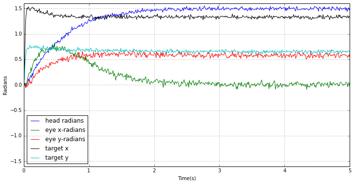
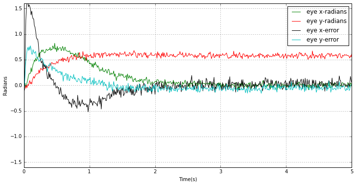
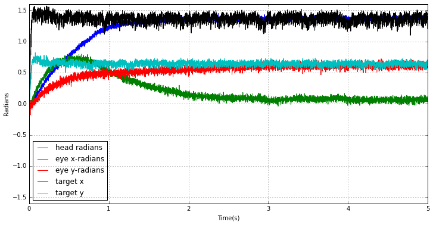
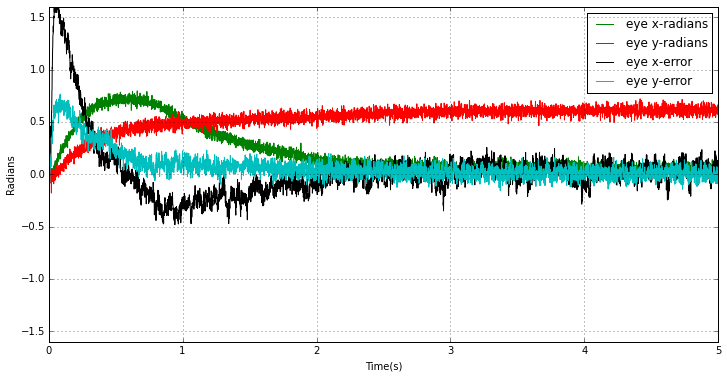

.. _head_movement_demo:

Head movement demo
==================

Running the simulation on the host
----------------------------------

.. sourcecode:: python
    :linenos:

    import nengo
    import numpy as np
    import robot_control.head
    head = reload(robot_control.head)
    
    model = nengo.Network("Head movement test", seed=len("SpiNNaker"))
    
    lips_offset = np.asarray([0, .2, 0])
    
    with model:
        target = nengo.Node(output=lambda t:[np.pi/2, np.pi/4])
        head = robot_control.head.Head(lips_offset, seed=len("SpiNNaker"))
        nengo.Connection(target, head.target_position)
        current_head_probe = nengo.Probe(head.current_head, sample_every=0.01, synapse=0.01)
        current_eye_probe = nengo.Probe(head.current_eye, sample_every=0.01, synapse=0.01)
        eye_error_probe = nengo.Probe(head.eye_error, sample_every=0.01, synapse=0.01)
        eye_ctrl_probe = nengo.Probe(head.eye_controller, sample_every=0.01, synapse=0.01)
        
    sim = nengo.Simulator(model)
    
    sim.run(5)

Running the simulation on SpiNNaker
-----------------------------------

.. sourcecode:: python
    :linenos:

    import nengo_spinnaker
    import nengo
    import numpy as np
    import robot_control.head
    
    robot_control.head = reload(robot_control.head)
    
    
    
    
    model = nengo.Network("Head movement test", seed=len("SpiNNaker"))
    
    lips_offset = np.asarray([0, .2, 0])
    
    with model:
        target = nengo.Node(output=lambda t:[np.pi/2, np.pi/4])
        head = robot_control.head.Head(lips_offset, seed=len("SpiNNaker"))
        nengo.Connection(target, head.target_position)
        current_head_probe = nengo.Probe(head.current_head, sample_every=0.01, synapse=0.01)
        current_eye_probe = nengo.Probe(head.current_eye, sample_every=0.01, synapse=0.01)
        eye_error_probe = nengo.Probe(head.eye_error, sample_every=0.01, synapse=0.01)
        
        eye_ctrl_probe = nengo.Probe(head.eye_controller, sample_every=0.01, synapse=0.01)
    
    nengo_spinnaker.add_spinnaker_params(model.config)   
    model.config[target].function_of_time = False
    
    sim = nengo_spinnaker.Simulator(model)
    with sim:
        sim.run(5)
    

