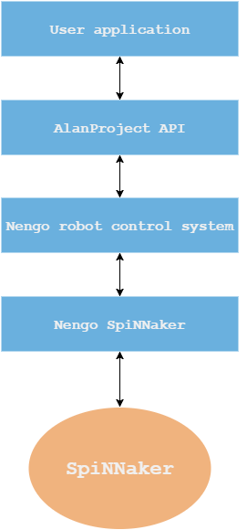

Getting started
===============

Requirements
------------

Running the software requires a `Python 2.7 <https://www.python.org/download/releases/2.7/>`_ interpreter.
This means it should run on all operating systems.

Running such a large simulation with a real-time constraint requires the use of the **SpiNNaker** platform.
As a result, the software in its current state does not support running the simulation via the provided
interface on host, but running only the simulation on host

Windows specific
^^^^^^^^^^^^^^^^

Windows users need to install the  `Microsoft Visual C++ Compiler for Python 2.7 <http://www.microsoft.com/en-gb/download/details.aspx?id=44266>`_
which is used when installing the ``numpy`` package.

Installation
------------

The easiest way to install everything is to clone the Alan Project repository, then run ``setup.py``. This
will install all required dependencies automatically.

.. note::

    The use of a ``virtualenv`` is recommended.

.. warning::

    As of |today|, the current  ``pip`` installation of
    `nengo <https://github.com/nengo/nengo>`_ and `nengo_spinnaker <https://github.com/project-rig/nengo_spinnaker>`_ are broken.
    The :download:`setup.py <../setup.py>` file has been
    specifically built to make use of known stable versions of both
    downloaded from their respective github repositories.

    If newer versions are desired, install them manually. **Install at your own risk!**

.. code:: bash

    git clone https://github.com/pabogdan/AlanProject
    cd AlanProject
    python setup.py develop

The last step is to run the following script. This step will guide you through setting up a configuration file for
communicating to a SpiNNaker board.

.. code::

    nengo_spinnaker_setup

Optional
^^^^^^^^

Installing the ``scipy`` package would increase the accuracy of the basal ganglia in the neural
simulation. This needs to be installed separately if desired.

Installing the ``nengo_gui`` package would allow for running graphically interactive neural simulations
with the possibility of viewing live output from it. There are two types of installations available for
it: using pip

.. code-block:: bash

    [sudo] pip install nengo_gui

or manual installation from their Git repository

.. code-block:: bash

    git clone https://github.com/nengo/nengo_gui
    cd nengo_gui
    python setup.py develop

For ``nengo_gui`` usage information visit their Github repository.

Usage
-----
This section will only focus on usage of the simulation through the provided interface. For an
in-depth look into how to run your own or modify existing nengo spiking neural network simulations,
visit their documentation_ webpages.

.. _documentation: https://pythonhosted.org/nengo/

   The current structure of the software.

The user application uses the provided API to control the simulation and
its parameters. The Nengo simulation running on host communicates to the
SpiNNaker board over Ethernet using a specially created library
(nengo_spinnaker and rig).

Nengo simulation
^^^^^^^^^^^^^^^^

The starting point for the control system is the Robot class, which is a stand-alone, complete and
modular ``nengo.Network``.

.. sourcecode:: python
    :linenos:

    import nengo
    from robot_control.robot import Robot

    model = nengo.Network()

    with model:
        robot = Robot()

At this point, the simulation has not started yet, only the object has been built. In order to start
the simulation we need to either run the above in ``nengo_gui`` or create a simulator.

.. sourcecode:: python
    :linenos:

    sim = nengo.Simulator(model)
    sim.run(10)

.. note::

    Running the above code in ``nengo_gui`` would also expose the inputs and outputs of the system.

The same general process goes for running simulations on SpiNNaker, with one of the small differences
being that the ``Simulator`` object that needs creating lives inside ``nengo_spinnaker``

.. note::

    A more detailed description of the neuromorphic control system is available
    at the robot control description :ref:`page <robot_control_readme>`.

    Moreover, :ref:`these <robot_utils_readme>` utilities are useful for creating control systems in a
    spiking neural network setting. Not all of them
    might have been used in the current implementation.

Simulation interface
^^^^^^^^^^^^^^^^^^^^

The purpose of this interface is to allow users with no experience working
with neural simulations using ``Nengo`` to
abstract that part software and just use a few API calls to achieve their goals.
It follows an event based model, meaning that code is executed only when a
certain event happens.

For example, the following snippet of code is sufficient to place a neural
simulation on a SpiNNaker board,

.. note::

    The example network is just proof how quickly and easily one can get the
    software side of things up and running.
    That being said, it's worth noting that the robot won't actually fit on
    only one SpiNNaker board, instead needing
    a 3 board toroid.

.. sourcecode:: python
    :linenos:

    # Import the package
    from robot_interface.alan_robot import AlanRobot

    # Create an instance of the robot
    robot = AlanRobot(run_time=5, period=10)

    # Start the neural simulation
    robot.start_simulation()

    # By default, the robot's motors can't be driven,
    # so this call enables the robot's motors
    robot.enable_robot()

In reality, the above is not all that useful as it does not allow modifying
inputs or viewing outputs. These operations are handled by :class:`.Container`
objects. The have the ability to update the value of an input
(i.e. :class:`.Sensor`, :class:`.ControlSignal`) and act upon the
value of an output (i.e. :class:`.Motor` using callbacks.

.. sourcecode:: python
    :linenos:
    :emphasize-lines: 10

    from __future__ import print_function
    from robot_interface.alan_robot import AlanRobot

    # Create an instance of the robot
    robot = AlanRobot(run_time=5, period=10)

    # Ask for a container of all motors in the robot
    motors = robot.motors
    # Act upon motor outputs -- print the name of the motors and its value
    motors.set_default_callback(callback=lambda x, y: print(x, y))

    # Start simulation and enable robot movement
    robot.start_simulation()
    robot.enable_robot()

The highlighted line shows the setting of the shows the setting of a default
action to be executed  time the value of any of the motors is updated.
In the given example, the value output by the neural simulation for a specific
motor is printed to standard output.

Apendix: Mathematical descriptions of position and orientation
^^^^^^^^^^^^^^^^^^^^^^^^^^^^^^^^^^^^^^^^^^^^^^^^^^^^^^^^^^^^^^

The center of the head will be defined as the origin of the world system
(right-handed coordinate system). As a result, the main target of the
arm (the robot's "lips") can be found at a constant offset from center
on the Y axis.

Position of the shoulder in the world coordinates (using homogeneous
matrices):

.. math::

   \,^WS =\begin{bmatrix}
       l\\
       0 \\
       -h \\
       0
   \end{bmatrix}

, with :math:`l =` shoulder width and :math:`h =` offset between the
center of the head and the base of the neck.

In addition, we need to define the orientation of the upper arm
(:math:`\{U\}`) in relation to the origin of the world system
(:math:`\{W\}`) by means of a rotation matrix. In this case, two
rotations are needed: one around the :math:`^W \hat X` axis, and the
other one around the :math:`^W \hat Y` axis. The first rotation is done
by a constant amount (:math:`\gamma`), while the other one is the degree
of freedom of the shoulder and can move freely to achieve the end goal
(:math:`\alpha`).

.. math::  \,^W_UR(\alpha) = \,R_Y(\gamma) \cdot \,R_X(\alpha) 

From this it follows that the elbow location could be easily expressed
in relation to the shoulder frame: it is located at a constant, given
offset from the shoulder on its :math:`^U \hat Y` axis. The orientation
of the lower arm (:math:`\{L\}`) frame can be describe by the rotation
matrix around the :math:`^U \hat X` axis.

.. math::  \,^U_L R(\beta) = \,R_X(\beta) 

Finally, the hand's position (:math:`H`) is computed easily with respect
to :math:`\{L\}` as it can be found at a constant, given offset on its
:math:`^L \hat Y` axis. By using the previously created reference chain,
we can compute the position of the hand in world coordinates as follows:

.. raw:: latex

   \begin{gather*}
       \,^WH =  \,^W_U R \,^U H + \,^W S \\ 
       where \\
       \,^U H = \,^U_L R \,^L H + \,^U E
   \end{gather*}

I believe there is no need to represent the orientation of the hand
because it is not taken into account when planning movement as the only
degree of freedom present there is in the finger.

`Reference book: "Introduction to robotics : mechanics and control" John J. Craig. 1989`

